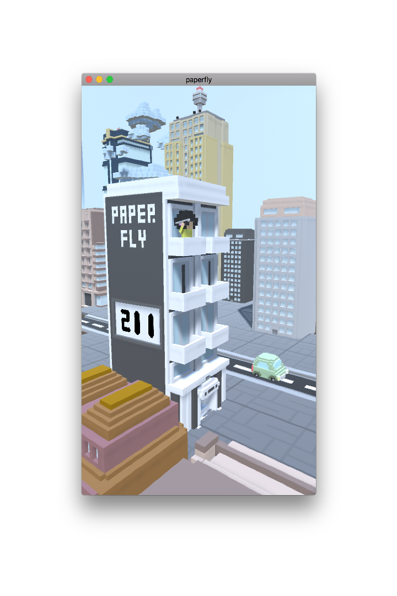
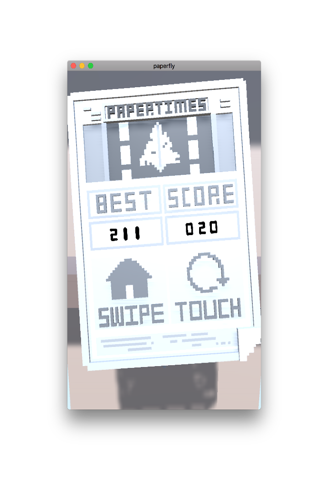
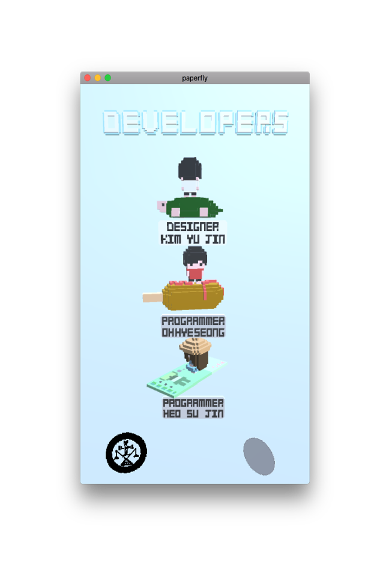

# Paperfly
> 2018.05.29 Sungkonghoe University IT 경진대회 게임 부문으로 참가한 작품입니다.

## 🎮How to Play
> macOS app 지원만 가능합니다.
```bash
open PF_2.0.0_mac_uni_450800.app
```

## 🧑🏻‍💻Team members
- yujin Kim
- hyesung Oh
- sujin Heo

## 🔨Dev environment
- Unity3d.2017
- C Sharp

## 📱Features
<p align="center">




</p>